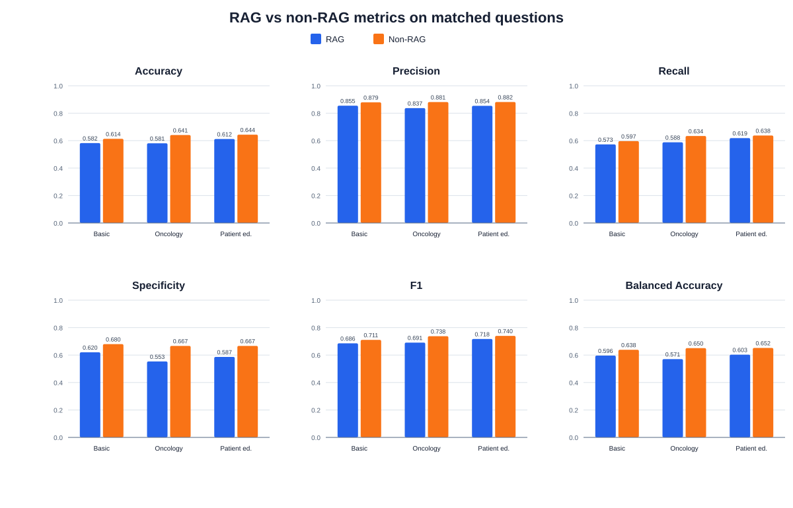
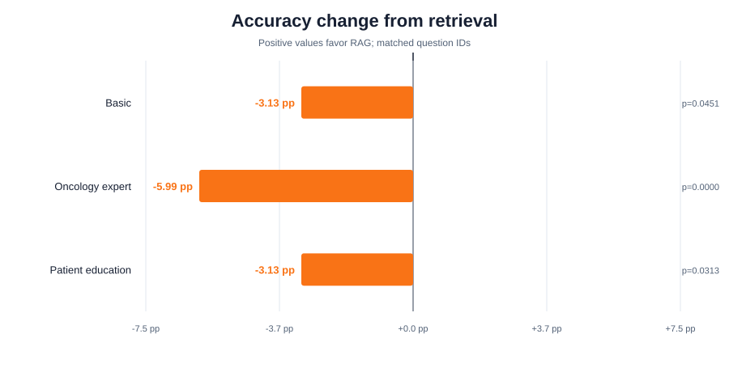
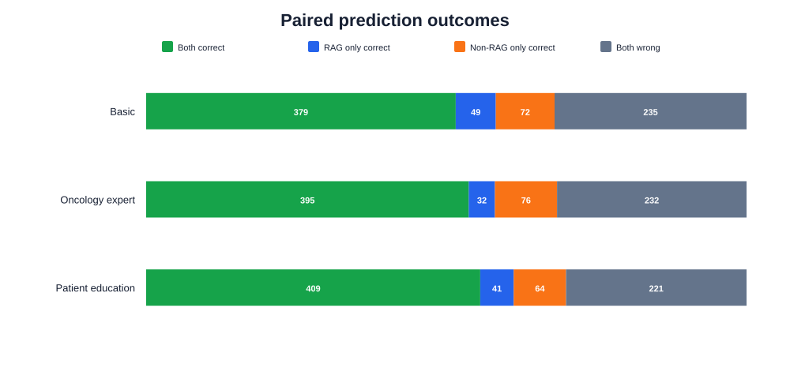
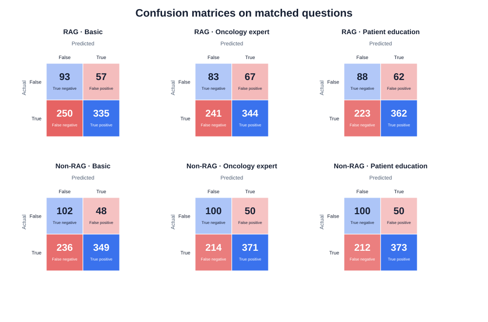

# RAG vs non-RAG result analysis

This report is generated by `rag-terra/result-analysis/analyze.py`. Re-run the script after any prediction CSV changes.

## Data completeness

| Condition | Prompt | Predictions | Coverage |
| --- | --- | ---: | ---: |
| RAG | Basic | 735 | 100.00% |
| RAG | Oncology expert | 735 | 100.00% |
| RAG | Patient education | 735 | 100.00% |
| NON-RAG | Basic | 735 | 100.00% |
| NON-RAG | Oncology expert | 735 | 100.00% |
| NON-RAG | Patient education | 735 | 100.00% |

The six-way intersection contains **735** question IDs. Pairwise comparisons below use each prompt's RAG/non-RAG intersection.
The reference labels contain **585 positive** and **150 negative** cases (79.59% positive), so accuracy must be read alongside specificity and balanced accuracy.

## Key findings

- RAG accuracy is higher for all three prompts by **-5.99 to -3.13 percentage points**. The paired exact McNemar p-values range from 0.000028 to 0.045052.
- RAG recall is higher by **-4.62 to -1.88 points**, but specificity is lower by **6.00 to 11.33 points**.
- Consequently, RAG balanced accuracy is lower by **4.20 to 7.97 points**. Retrieval shifts the classifier toward the majority positive class rather than improving both classes uniformly.
- The highest raw accuracy is **64.35%** (NON-RAG, Patient education); the highest balanced accuracy is **65.21%** (NON-RAG, Patient education).

## Overall matched results

| Prompt | Condition | n | Accuracy (95% CI) | Precision | Recall | Specificity | F1 | Balanced accuracy |
| --- | --- | ---: | ---: | ---: | ---: | ---: | ---: | ---: |
| Basic | RAG | 735 | 58.23% (54.63% to 61.74%) | 85.46% | 57.26% | 62.00% | 68.58% | 59.63% |
| Basic | NON-RAG | 735 | 61.36% (57.79% to 64.81%) | 87.91% | 59.66% | 68.00% | 71.08% | 63.83% |
| Oncology expert | RAG | 735 | 58.10% (54.50% to 61.61%) | 83.70% | 58.80% | 55.33% | 69.08% | 57.07% |
| Oncology expert | NON-RAG | 735 | 64.08% (60.55% to 67.47%) | 88.12% | 63.42% | 66.67% | 73.76% | 65.04% |
| Patient education | RAG | 735 | 61.22% (57.65% to 64.68%) | 85.38% | 61.88% | 58.67% | 71.75% | 60.27% |
| Patient education | NON-RAG | 735 | 64.35% (60.82% to 67.73%) | 88.18% | 63.76% | 66.67% | 74.01% | 65.21% |

## Retrieval effect

| Prompt | Matched n | RAG accuracy | Non-RAG accuracy | Difference | RAG-only correct | Non-RAG-only correct | Exact McNemar p |
| --- | ---: | ---: | ---: | ---: | ---: | ---: | ---: |
| Basic | 735 | 58.23% | 61.36% | -3.13 pp | 49 | 72 | 0.045052 |
| Oncology expert | 735 | 58.10% | 64.08% | -5.99 pp | 32 | 76 | 0.000028 |
| Patient education | 735 | 61.22% | 64.35% | -3.13 pp | 41 | 64 | 0.031302 |

## Interpretation guardrails

- A positive difference means RAG was more accurate for that prompt on the same questions; it does not by itself establish that retrieval caused the change.
- The exact McNemar test uses only discordant matched predictions. Its p-values are exploratory and are not adjusted for the three prompt comparisons.
- Wilson intervals describe each accuracy estimate separately; they are not confidence intervals for the paired accuracy difference.
- `true` is treated as the positive class: the question contains a false or materially misleading assumption.
- Subgroup rows, especially individual cancer types, can be small. Use `subgroup_metrics.csv` for error exploration rather than definitive ranking.
- The prediction files do not include latency, token use, retrieval relevance, or cost, so this report cannot compare those dimensions.

## Machine-readable artifacts

- `metrics.csv`: available-run and pairwise-matched classification metrics.
- `paired_comparison.csv`: matched accuracy differences, error overlap, and exact McNemar tests.
- `subgroup_metrics.csv`: six-way-matched metrics by dataset split and cancer type.
- `predictions.csv`: reference labels and all six predictions, joined by question ID.
- `disagreements.csv`: questions where corresponding RAG and non-RAG predictions differ.
- `errors.csv`: every incorrect prediction with question text.
- `manifest.json`: paths, hashes, counts, and analysis assumptions.
