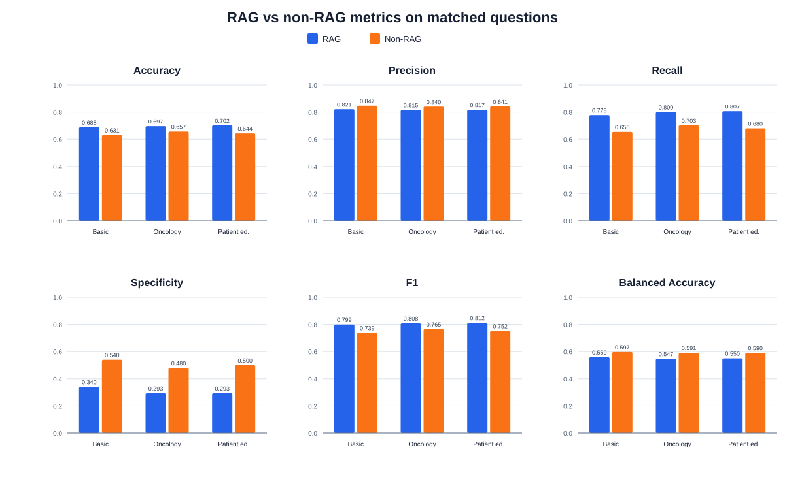
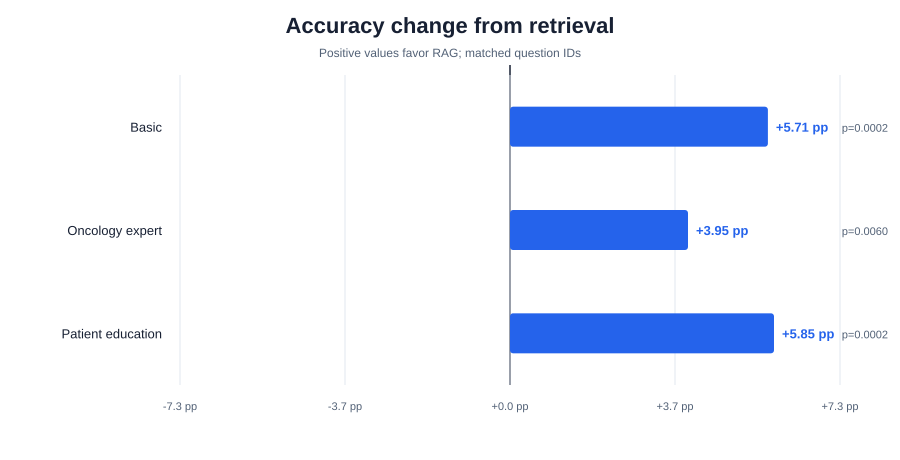
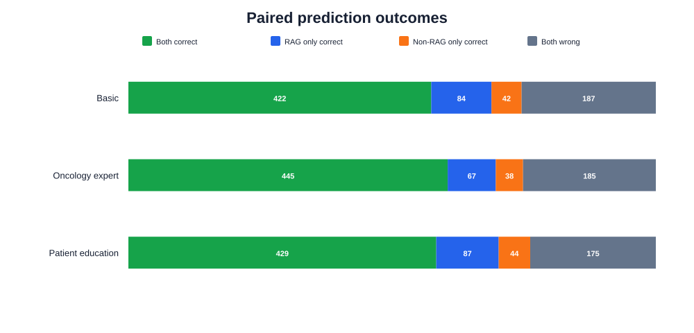
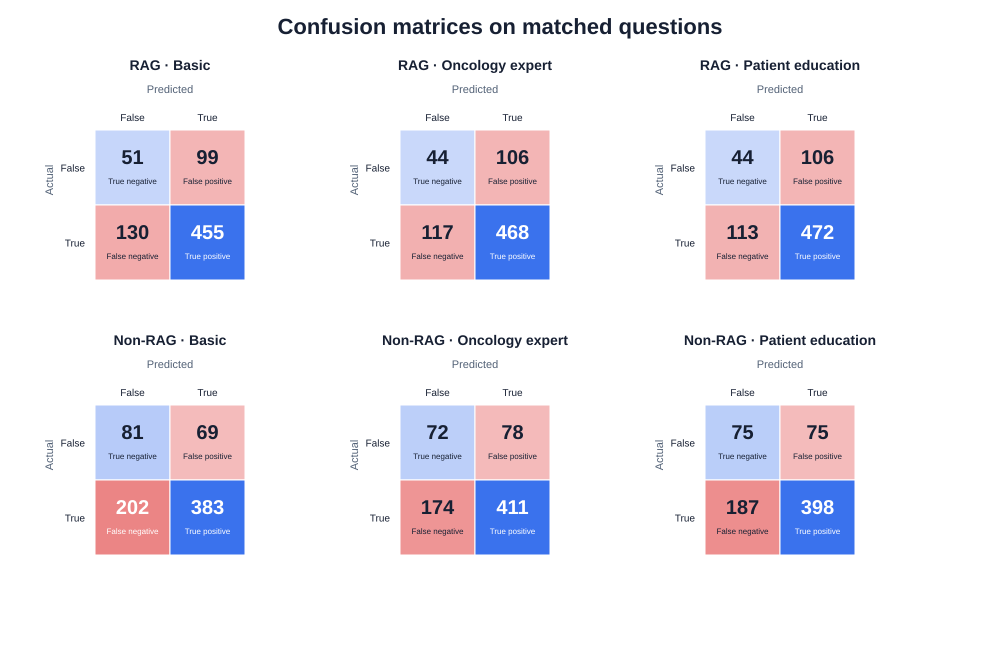

# RAG vs non-RAG result analysis

This report is generated by `result-analysis/analyze.py`. Re-run the script after any prediction CSV changes.

## Data completeness

| Condition | Prompt | Predictions | Coverage |
| --- | --- | ---: | ---: |
| RAG | Basic | 735 | 100.00% |
| RAG | Oncology expert | 735 | 100.00% |
| RAG | Patient education | 735 | 100.00% |
| NON-RAG | Basic | 735 | 100.00% |
| NON-RAG | Oncology expert | 735 | 100.00% |
| NON-RAG | Patient education | 735 | 100.00% |

The six-way intersection contains **735** question IDs. Pairwise comparisons below use each prompt's RAG/non-RAG intersection.
The reference labels contain **585 positive** and **150 negative** cases (79.59% positive), so accuracy must be read alongside specificity and balanced accuracy.

## Key findings

- RAG accuracy is higher for all three prompts by **3.95 to 5.85 percentage points**. The paired exact McNemar p-values range from 0.000216 to 0.006016.
- RAG recall is higher by **9.74 to 12.65 points**, but specificity is lower by **18.67 to 20.67 points**.
- Consequently, RAG balanced accuracy is lower by **3.85 to 4.46 points**. Retrieval shifts the classifier toward the majority positive class rather than improving both classes uniformly.
- The highest raw accuracy is **70.20%** (RAG, Patient education); the highest balanced accuracy is **59.74%** (NON-RAG, Basic).

## Overall matched results

| Prompt | Condition | n | Accuracy (95% CI) | Precision | Recall | Specificity | F1 | Balanced accuracy |
| --- | --- | ---: | ---: | ---: | ---: | ---: | ---: | ---: |
| Basic | RAG | 735 | 68.84% (65.40% to 72.09%) | 82.13% | 77.78% | 34.00% | 79.89% | 55.89% |
| Basic | NON-RAG | 735 | 63.13% (59.58% to 66.54%) | 84.73% | 65.47% | 54.00% | 73.87% | 59.74% |
| Oncology expert | RAG | 735 | 69.66% (66.24% to 72.87%) | 81.53% | 80.00% | 29.33% | 80.76% | 54.67% |
| Oncology expert | NON-RAG | 735 | 65.71% (62.21% to 69.06%) | 84.05% | 70.26% | 48.00% | 76.54% | 59.13% |
| Patient education | RAG | 735 | 70.20% (66.80% to 73.40%) | 81.66% | 80.68% | 29.33% | 81.17% | 55.01% |
| Patient education | NON-RAG | 735 | 64.35% (60.82% to 67.73%) | 84.14% | 68.03% | 50.00% | 75.24% | 59.02% |

## Retrieval effect

| Prompt | Matched n | RAG accuracy | Non-RAG accuracy | Difference | RAG-only correct | Non-RAG-only correct | Exact McNemar p |
| --- | ---: | ---: | ---: | ---: | ---: | ---: | ---: |
| Basic | 735 | 68.84% | 63.13% | +5.71 pp | 84 | 42 | 0.000230 |
| Oncology expert | 735 | 69.66% | 65.71% | +3.95 pp | 67 | 38 | 0.006016 |
| Patient education | 735 | 70.20% | 64.35% | +5.85 pp | 87 | 44 | 0.000216 |

## Interpretation guardrails

- A positive difference means RAG was more accurate for that prompt on the same questions; it does not by itself establish that retrieval caused the change.
- The exact McNemar test uses only discordant matched predictions. Its p-values are exploratory and are not adjusted for the three prompt comparisons.
- Wilson intervals describe each accuracy estimate separately; they are not confidence intervals for the paired accuracy difference.
- `true` is treated as the positive class: the question contains a false or materially misleading assumption.
- Subgroup rows, especially individual cancer types, can be small. Use `subgroup_metrics.csv` for error exploration rather than definitive ranking.
- The prediction files do not include latency, token use, retrieval relevance, or cost, so this report cannot compare those dimensions.

## Machine-readable artifacts

- `metrics.csv`: available-run and pairwise-matched classification metrics.
- `paired_comparison.csv`: matched accuracy differences, error overlap, and exact McNemar tests.
- `subgroup_metrics.csv`: six-way-matched metrics by dataset split and cancer type.
- `predictions.csv`: reference labels and all six predictions, joined by question ID.
- `disagreements.csv`: questions where corresponding RAG and non-RAG predictions differ.
- `errors.csv`: every incorrect prediction with question text.
- `manifest.json`: paths, hashes, counts, and analysis assumptions.
